# MCRF

Клиент для Windows: VPN, Zapret, WARP и маршрутизация сервисов в одном приложении.

[Скачать](https://github.com/vnenapravo7-source/mcrf/releases) · [VirusTotal · 0.3.4](https://www.virustotal.com/gui/file/963a59819d18697e20682813a1eab6576e74595f175fa239b0e3ab91abe0d871) · [Сообщить о проблеме](https://github.com/vnenapravo7-source/mcrf/issues)

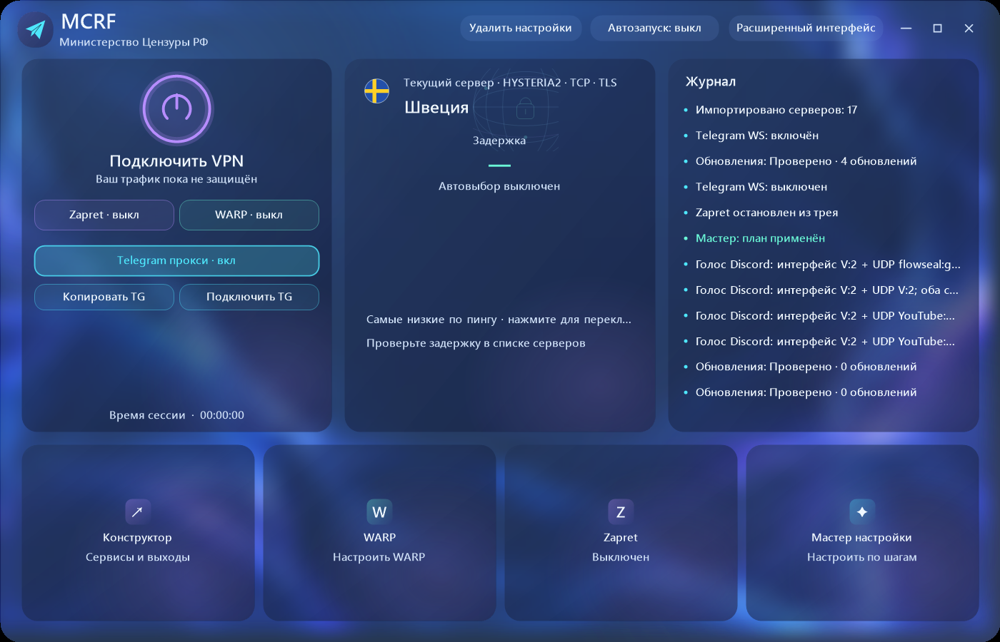

## Возможности

| Раздел | Функции |
| --- | --- |
| Мастер настройки | Подбор стратегий, автоматические и ручные проверки сервисов, проверка голоса Discord |
| VPN | Серверы и подписки, WireGuard / AmneziaWG, TUN и локальный прокси |
| Zapret | Отдельные профили, стратегии и пресеты для разных сервисов; автосохранение в таблице; независимые игровые фильтры TCP / UDP |
| Запись процесса | Сбор адресов выбранного процесса через VPN/TUN или с Zapret без VPN; для записи без VPN нужны права администратора, записываются IP новых TCP/UDP-соединений |
| WARP | Создание профиля, поиск доступного выхода, выбор маршрутизируемых сервисов |
| Конструктор | Выбор выхода, стратегии, источника hosts и состава VPN-пресетов |
| hosts | Instagram и ChatGPT вместе с Zapret; дополнительные сервисы; управление записями MCRF |
| Пресеты | Встроенные домены и IP; обновление с GitHub с сохранением названий |
| Выходы и DNS | Общий, системный или отдельный DNS для выхода |
| Telegram | Локальный WS-прокси и ссылка подключения в Telegram |
| Обновления | Программа, движки, стратегии и списки; установка по выбору пользователя |
| Настройки | Два режима интерфейса, автозапуск, сброс с бэкапом и восстановление |

### Серверы и протоколы

Импорт ссылок, подписок и файлов `.conf`, выбор сервера и проверка задержки.

| Протоколы | Поддержка в MCRF |
| --- | --- |
| VLESS | TCP, gRPC, WebSocket, HTTPUpgrade и XHTTP; TLS / REALITY |
| VMess, Trojan, Shadowsocks | Подключение через встроенный движок |
| WireGuard / AmneziaWG | Импорт профилей; также используются для WARP |
| Hysteria / Hysteria2, TUIC | Подключение к совместимому серверу |
| AnyTLS, NaiveProxy, SSH | Подключение по поддерживаемым ссылкам |
| HTTP / SOCKS5 | Подключение к внешнему прокси |

#### CSQTT · WDTT · OpenFlux

Дополнительные туннели с отдельными движками — скачиваются из интерфейса MCRF, запускаются и останавливаются вместе с подключением.

| Движок | Что делает | Особенности |
| --- | --- | --- |
| **[CSQTT](https://github.com/amurcanov/csqtt)** | Защищённый туннель поверх TURN/RTP — транспорт под зашифрованный медиатрафик звонка | Windows-клиент и локальный мост; некоммерческая лицензия компонента |
| **[WDTT](https://github.com/ildarmaga/wdtt)** | WireGuard через DTLS/TURN | Локальный SOCKS5-выход; **qWDTT пока не поддерживается** |
| **[OpenFlux](https://github.com/p1neappleXpress/OpenFlux)** | TCP-туннель с переключаемыми транспортами | Импорт ссылок `openflux://v1/` |

Выходы дополнительных движков подключаются к общей маршрутизации MCRF: можно назначать сервисы и использовать TUN. Нужны совместимый сервер и корректный профиль; наличие протокола не гарантирует доступность в конкретной сети.

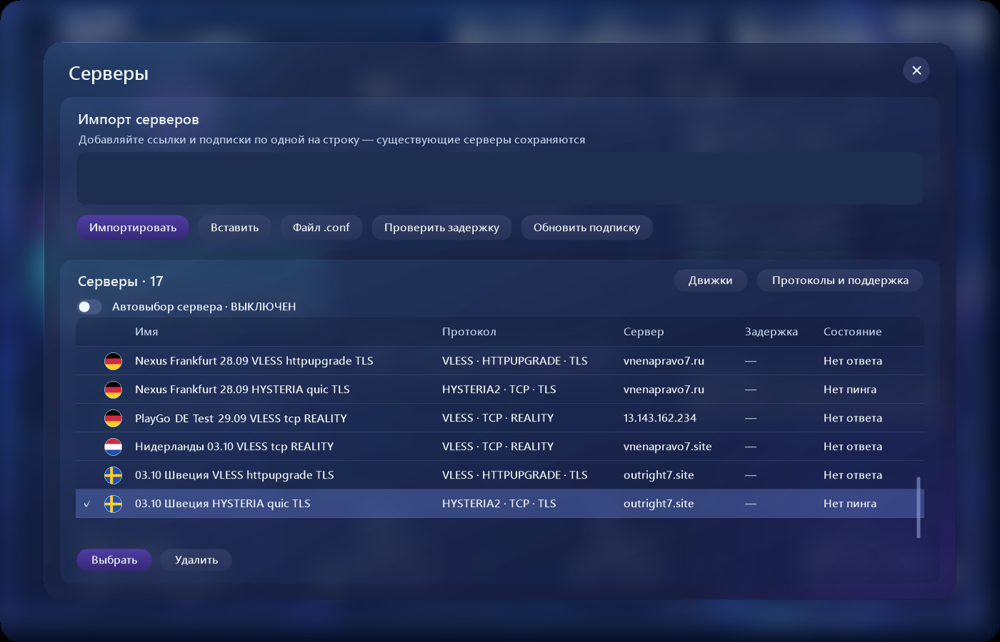

Протоколы и дополнительные движки

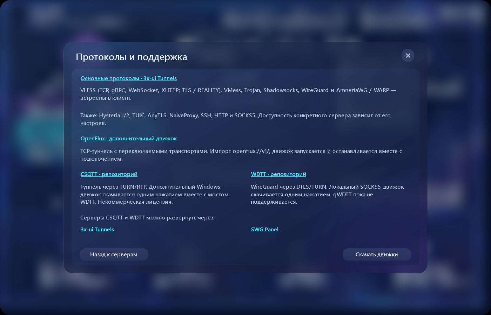

### Zapret и проверки

### Глобальные горячие клавиши

Для каждого профиля Zapret можно назначить необязательное сочетание в столбце «Горячая клавиша». Оно включает или выключает этот профиль. Стратегия и пресеты должны быть настроены заранее.

В «Настройки → Глобальные горячие клавиши» доступны отдельные сочетания для Telegram WS прокси, WARP и TUN. Выберите Ctrl, Shift и/или Alt и одну обычную клавишу: например, `Ctrl + P`, `Ctrl + Shift + P` или `Ctrl + Shift + Alt + P`. Кнопка «Убрать» снимает назначение. Занятые сочетания не заменяют сохранённую клавишу; F12 зарезервирована Windows.

Сочетания работают глобально в Windows, пока MCRF запущен, в том числе в трее. TUN использует выбранный режим TUN и текущие маршруты, не переключая приложение из режима локального прокси. Требования к правам администратора сохраняются.

Повторный запуск открывает уже работающее окно вместо второй копии. Если серверы не добавлены, уведомления об обновлениях sing-box и дополнительных движков не показываются; ручная проверка доступна.

### Проверки стратегий

Отдельные стратегии для каждого выхода и цветные результаты проверки сервисов.

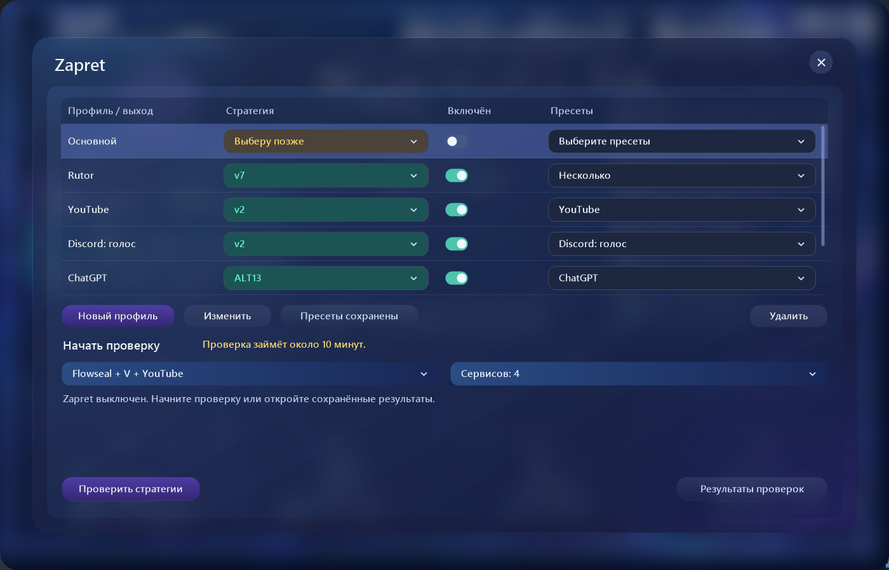

Результаты проверок

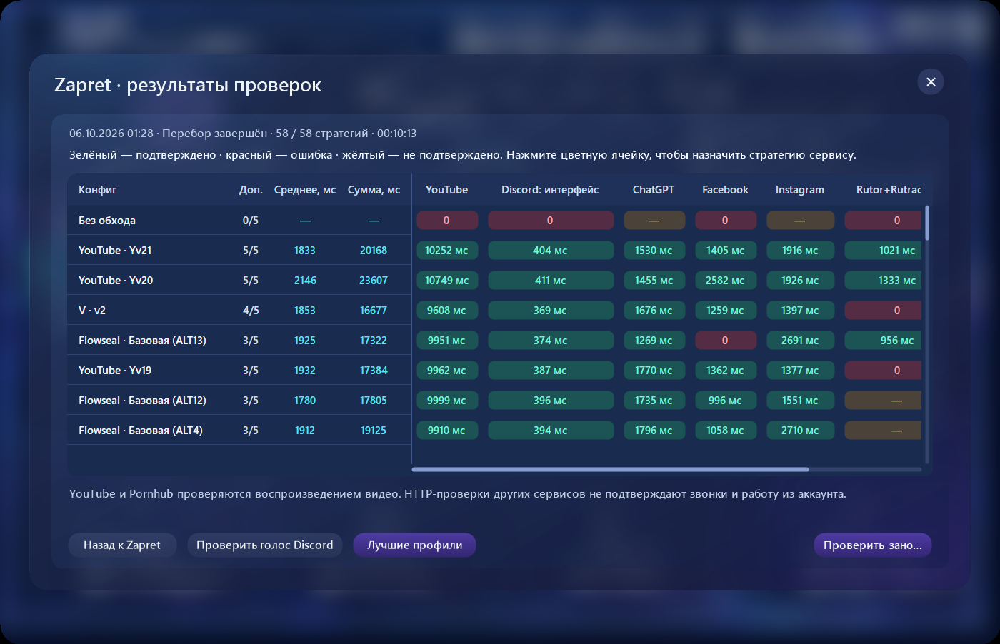

### WARP

Создание профиля, выбор страны и подключённых пресетов, поиск доступного выхода.

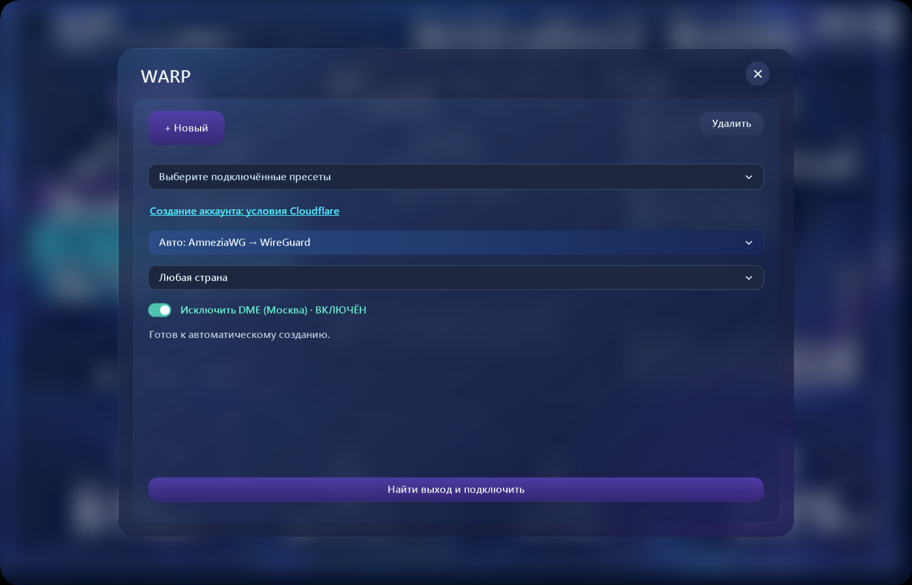

ByeTube — резервный способ обхода YouTube

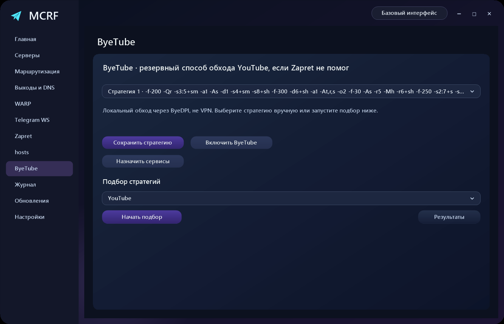

### Конструктор сервисов

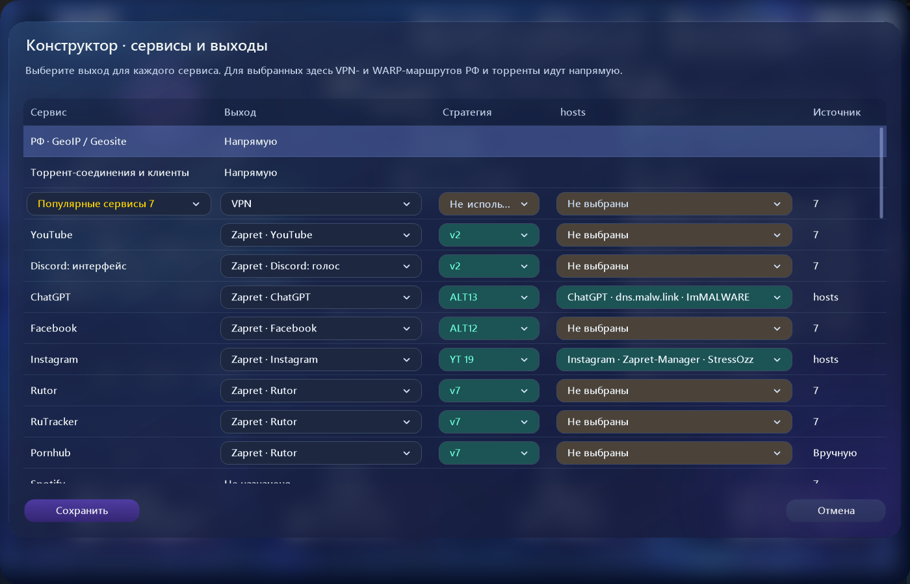

Выход, стратегия и hosts — в одной таблице. Цвет отражает результат проверки: зелёный — работает, жёлтый — требует подтверждения, красный — не работает, бирюзовый — смешанный результат.

### Маршруты

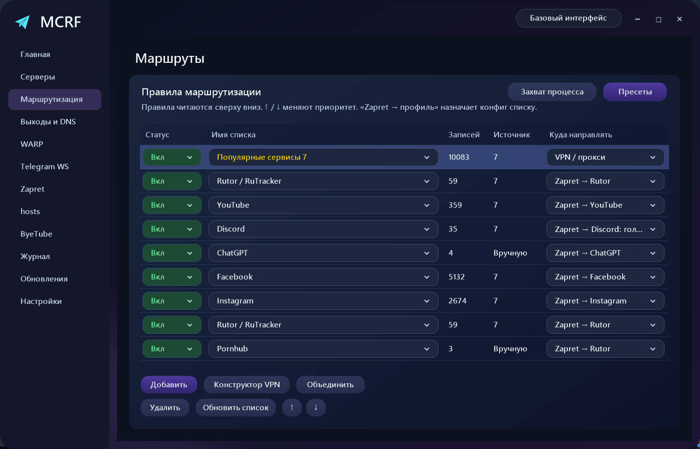

Правила для доменов, IP-сетей и приложений. Приоритет задаётся порядком правил.

### hosts

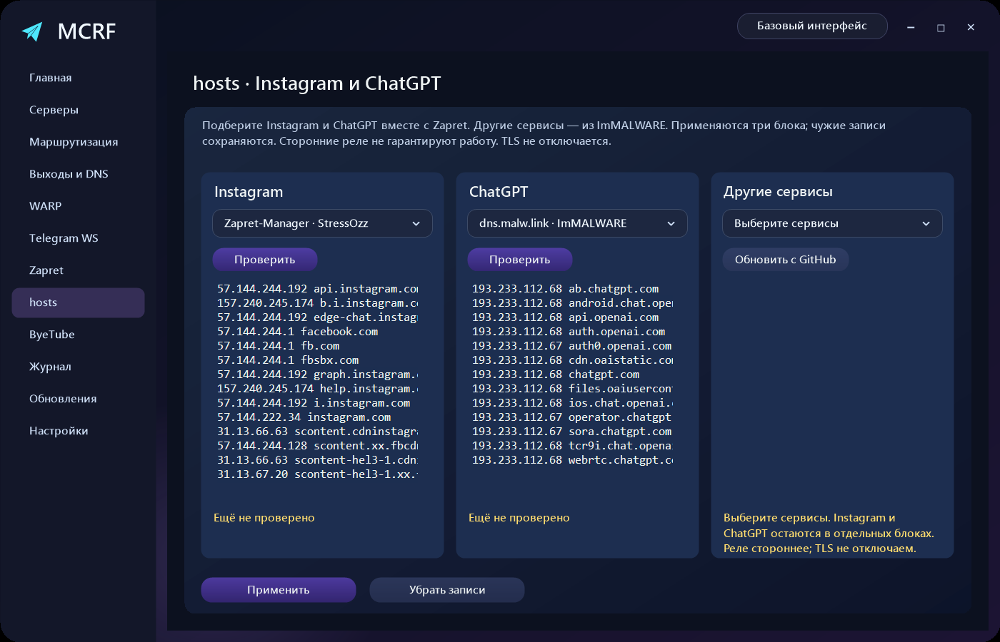

Instagram, ChatGPT и дополнительные сервисы — отдельными блоками. Чужие записи hosts сохраняются.

Выходы и DNS

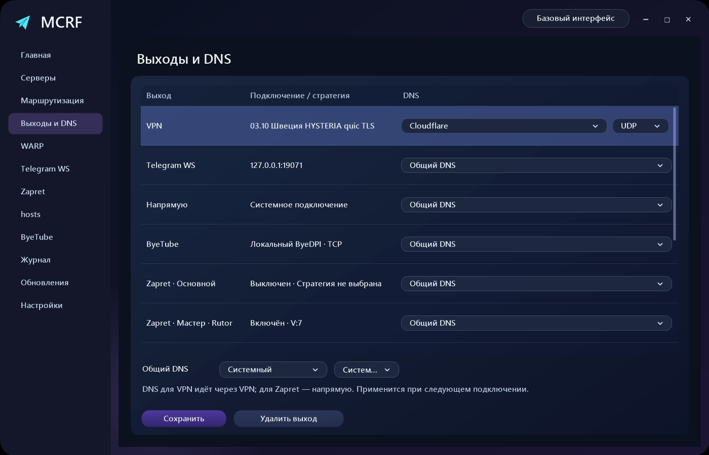

Общий DNS или отдельный провайдер и протокол для каждого выхода.

Обновления компонентов

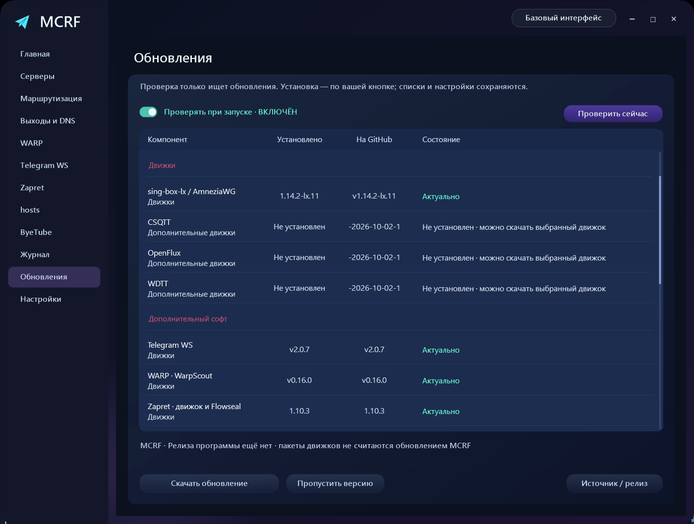

Проверка версий движков, дополнительного софта, стратегий и списков. Установка — по вашей кнопке.

## Быстрый старт

1. Скачайте `mcrf.exe` из [релизов](https://github.com/vnenapravo7-source/mcrf/releases).
2. Для TUN, Zapret и изменения системного hosts запустите приложение от администратора.
3. Откройте мастер. Если нужен VPN, импортируйте сервер или подписку.
4. Пройдите проверки, подтвердите работу сервисов и примените план.

Основные компоненты встроены в EXE. OpenFlux, WDTT и CSQTT устанавливаются отдельно. Своего VPN-сервера или подписки приложение не предоставляет.

## Проверка файла

[Отчёт VirusTotal для MCRF 0.3.4](https://www.virustotal.com/gui/file/963a59819d18697e20682813a1eab6576e74595f175fa239b0e3ab91abe0d871) относится к конкретному EXE. Результаты сканирования могут меняться; ссылка не является гарантией безопасности или подтверждением ложных срабатываний.

SHA-256: `963a59819d18697e20682813a1eab6576e74595f175fa239b0e3ab91abe0d871`. Контрольная сумма также опубликована в `SHA256SUMS.txt` рядом с EXE в релизе.

## Важно

- HTTP и двусторонний UDP не гарантируют воспроизведение видео и слышимость голоса. Для этого есть ручное подтверждение.
- WARP и сторонние hosts-реле зависят от сети и доступности внешних серверов.
- Локальный прокси не перенаправляет весь трафик Windows: настройте его в нужном приложении либо используйте TUN.
- Автозапуск, изменение hosts и применение маршрутов выполняются по выбору пользователя.

## Компоненты и сборка

[sing-box-lx](https://github.com/Leadaxe/sing-box-lx) · [Zapret / Flowseal](https://github.com/Flowseal/zapret-discord-youtube) · [WarpScout](https://github.com/vernette/warpscout) · [Telegram Proxy](https://github.com/y0sy4/telegram-proxy) · [ByeDPI](https://github.com/hufrea/byedpi)

Лицензии компонентов включены в приложение. Сборка: `native/build.ps1` — Windows, C# / .NET Framework.

[Исходники приложения](native/) · [Инструкция сборки и зависимости](docs/BUILD.md)

[Документация разработчика](docs/DEVELOPMENT.md)

*Результаты на скриншотах — примеры для конкретного подключения. Доступность сервисов зависит от вашей сети.*
